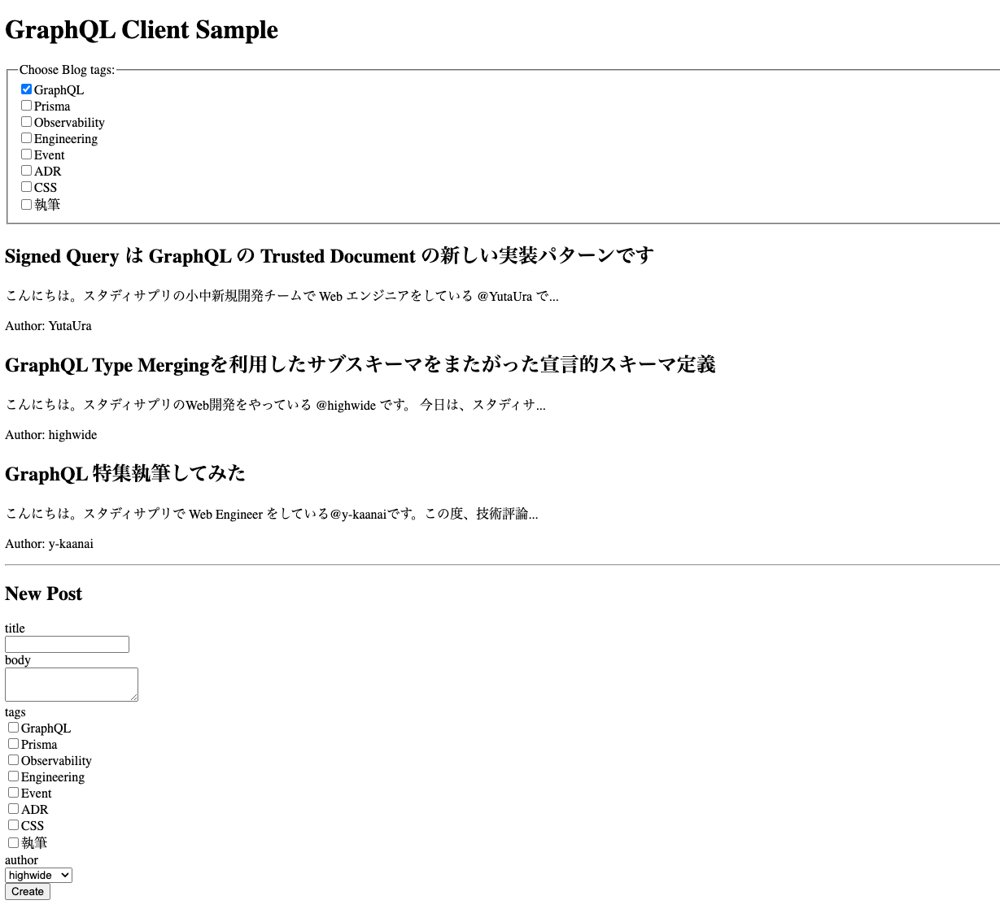

## 04_client に置かれたコードについて

Software Design 2024年9月号 GraphQL特集における「第4章 クライアントアプリケーションの実装」のためのサンプルコードです。

1. まずシンプルにurqlを使ったクライアントアプリケーションを実装する
2. そのアプリケーションにgraphql-codegenを使って型生成する
3. さらにFragment Colocationを使ってより良い設計にする

...という構成に誌面がなっているため、それぞれ...

* 01_simple_client/
* 02_graphql_codegen/
* 03_fragment_colocation/

というディレクトリ内に完成したアプリケーションを配置しています。
それぞれのディレクトリに置かれたコードを見比べていただくことで、どのような改善が行われたのかわかりやすくなるのではないかと思います。

なお、server/ というディレクトリには `npm install` 後に `npm start` するとlocalhost:4000で立ち上がるApollo Serverのコードが置かれています。定義自体は第2章や第3章と同様のものです。
アプリケーションを動かしたり、graphql-codegenをする際のGraphQLスキーマの参照先として、サーバーのコードも簡単に配置していますが、適宜第3章を参考に自分で実装したサーバーを見るなどの変更をしてみてください。

クライアントアプリケーションは

```
npm install
```

のうえで

```
npm run dev
```

で動きます。ご参考になれば幸いです！


